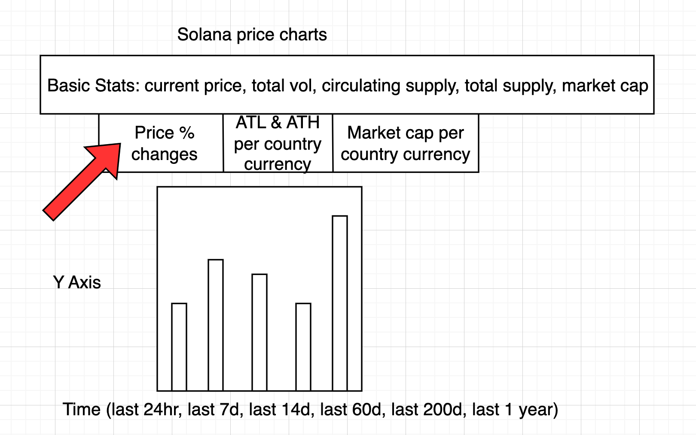
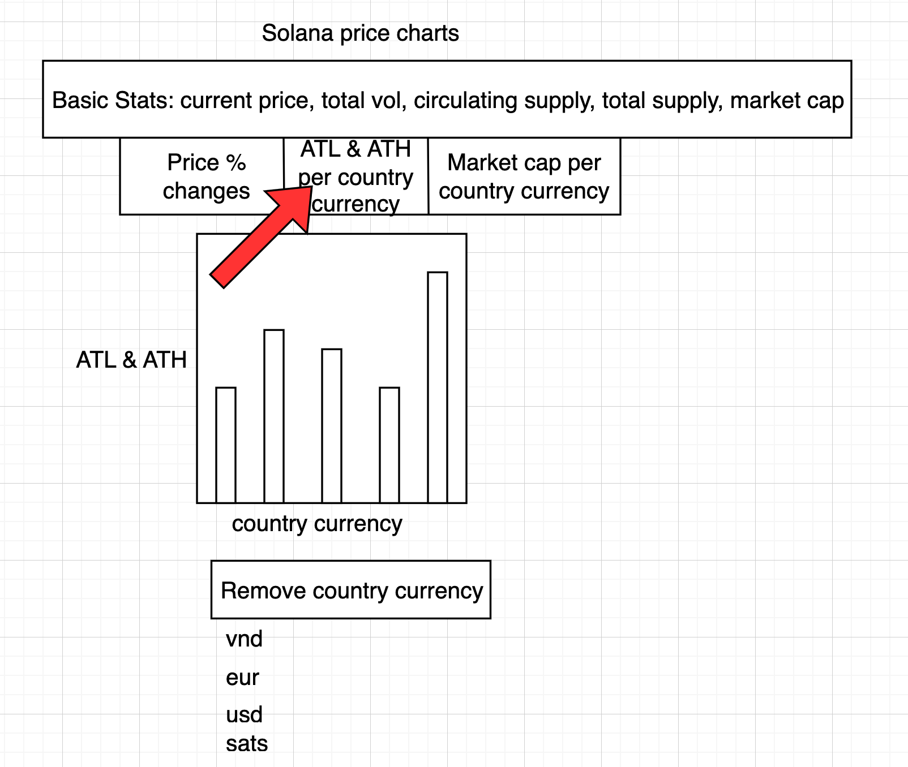
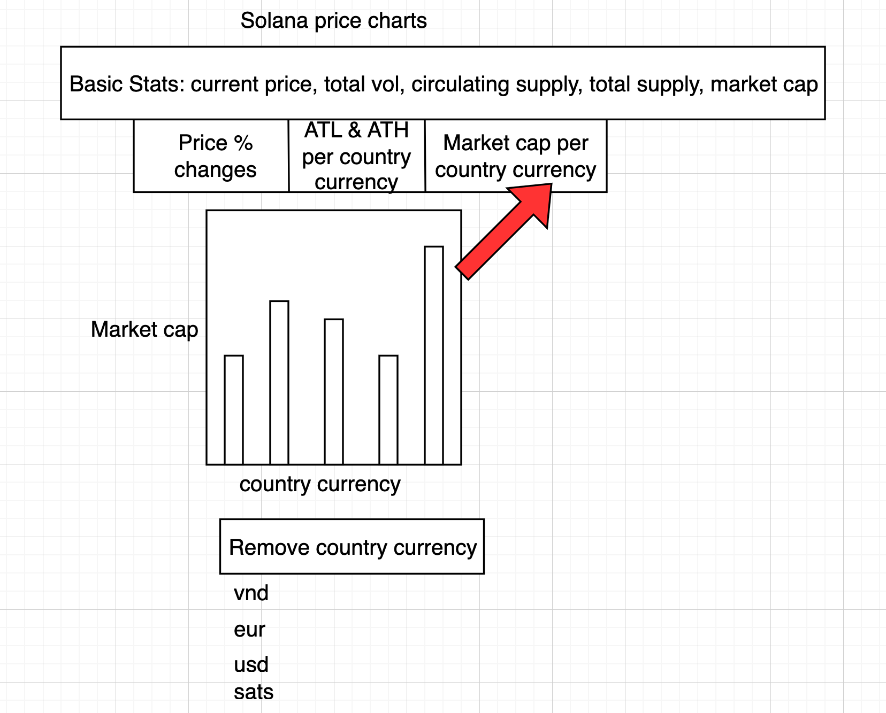

## Solana Data Visualization Dashboard

Create a multi-view dashboard that transforms complex price and comment data into insightful, interactive visualizations, demonstrating your ability to present information clearly and engagingly.

## How to run

```shell
cd my-app
yarn install
yarn start
```

A localdev browser starts up at http://localhost:3000/.

### What I did

I've created a comprehensive dashboard component that visualizes Solana price data in three different charts:

- Price Delta History Chart: Shows the price delta over time
- All time high & all time low by currnecy: Solana coin price by each country's currency
- Market Capitalization Chart: Tracks the market cap changes by each country's currency

Show some fake comments with timestamps at the bottom of the page.

Used styled React components, material UI library, and rechart library.

### Diagrams

1. Track the delta Solana price in discrete time blocks: last 24hr, last 7d, last 14d, last 60d, last 200d, last year.



2. Track the ATL & ATH Solana price per country
   

3. Track the market cap per country
   

### Design Decisions

- Decided to show the coingecko API data in the form of bar charts,
  because most of [the coingecko data](https://api.coingecko.com/api/v3/coins/solana) is distributed by country currency.
- Coingecko API doesn't have the data for solana coin price over time that I can easily render. There's no time series data in the coingecko API.
- Used react hooks to keep track of each of the 3 bar charts.
- Created a `useEffect()` for 1st time app load.
- Created a 2nd `useEffect()` for re-rendering the chart when you remove a currency country from dropdown selector.

Any additional features or improvements you would add given more time?

- Would be nice to create a generic SolanaChart react component for all 3 bar charts.
- Would be nice to create a multi-seector dropdown to remove multiple country currencies.
- Would be nice to refactor 2nd `useEffect()` to make use of a global storage.
- Would be nice to to have additional strict typescript interfaces inside `fetchData()`.
- Would be nice to show a more exact coin price over time.
- Would be nice to do more secure API key management for the coingecko API.
- Would be nice to to have unit tests & e2e tests.
